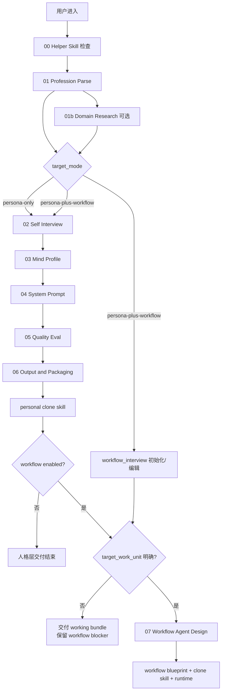
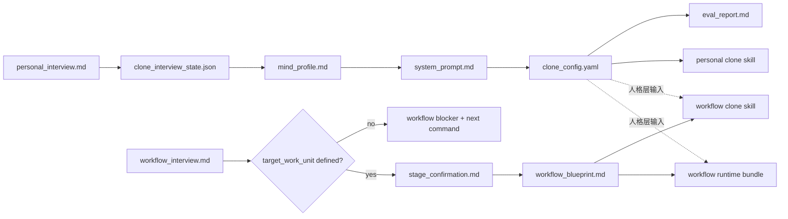

# Current System Flow

这份文档把 `mind-clone-creator` 当前已经实现的功能流程收成一张单文档地图。

它回答的是：

- 用户从哪里进入
- 系统后台实际会经过哪些阶段
- 产物如何一层层生成
- workflow/runtime 扩展是怎么接上的
- operator 侧如何验证整套链路

它不是 PRD，也不替代各 `steps/*.md` 的细节说明。需要看某一步的具体规则时，继续打开对应 step 文档。

## 1. 当前系统到底产出什么

当前系统支持两个顶层目标：

- `persona-only`：交付人格层分身，能更像本人地回答、澄清、评审、给建议，并保留用户的判断风格、表达方式、边界意识
- `persona-plus-workflow`：在同一个 working bundle 里同时保留人格层和 workflow 轨道；如果第一类典型工作还没确认，先交付 `workflow_interview.md` 与显式 blocker，确认后再编译 workflow 链路

当前边界：

- 默认不等于全自动执行 Agent
- 默认不等于完整 workflow + decision layer
- 人格层仍然是基础，但 workflow 轨道可以从入口就开启
- 只有在 `target_work_unit` 明确后，才继续编译 workflow blueprint、workflow clone skill 与 runtime bundle

## 2. 一眼图

### A. 用户入口到交付

文字版：

`用户进入`
→ `00 skill check`
→ `01 profession parse`
→ `选择 target_mode`
→ `02 self interview`
→ `03 mind profile`
→ `04 system prompt`
→ `05 quality eval`
→ `06 output`
→ `personal clone skill`
→ `如果 workflow 已启用：先看 target_work_unit 是否明确；未明确则保留 blocker，明确后进入 07 workflow agent design`

### B. 产物生成链路

文字版：

`personal_interview.md`
→ `clone_interview_state.json`
→ `mind_profile.md`
→ `system_prompt.md`
→ `clone_config.yaml`
→ `eval_report.md`
→ `personal clone skill`

如果启用 `persona-plus-workflow`：

`workflow_interview.md`
→ `workflow_target blocker 或 stage_confirmation.md`
→ `workflow_blueprint.md`
→ `workflow clone skill`
→ `workflow runtime bundle`

### C. Operator 检查链路

<!-- BEGIN GENERATED: current-flow-operator-route -->
<!-- Generated from references/operator_commands.json via scripts/render_operator_command_docs.py. Do not edit by hand. -->

文字版：

`validate_repo_docs`
→
`rebuild_sample_stack`
→
`doctor sample-stack`
→
`doctor current-stack`
→
`doctor latest-stack --explain`
→
`validate latest-stack`
→
`explain latest-stack`
→
`validate release-readiness`

<!-- END GENERATED: current-flow-operator-route -->

```mermaid
flowchart LR
    N1[validate_repo_docs] --> N2[rebuild_sample_stack]
    N2[rebuild_sample_stack] --> N3[doctor sample-stack]
    N3[doctor sample-stack] --> N4[doctor current-stack]
    N4[doctor current-stack] --> N5[doctor latest-stack --explain]
    N5[doctor latest-stack --explain] --> N6[validate latest-stack]
    N6[validate latest-stack] --> N7[explain latest-stack]
    N7[explain latest-stack] --> N8[validate release-readiness]
```

## 3. 端到端主流程

### A. 用户可见 5 步

1. 建立轮廓
2. 深度访谈
3. 确认画像
4. 自动生成与评测
5. 交付 `final` 或 `draft`

这是外层体验；后台实际会拆成更细的执行阶段。

### B. 后台真实执行阶段

#### 00. Helper Skill 检查

目标：

- 先确认当前环境里哪些辅助 skill 真可用
- 避免后面把流程建立在不存在的能力上

核心文档：

- [steps/00_skill_check.md](../steps/00_skill_check.md)

典型脚本：

- `scripts/check_helper_skills.py`
- `scripts/prepare_skill_gap_plan.py`
- `scripts/install_helper_skill.py`

#### 01. Profession Parse

目标：

- 收缩用户是谁、主要做什么、典型工作长什么样
- 识别后续是否需要职业研究或额外 skill

核心文档：

- [steps/01_profession_parse.md](../steps/01_profession_parse.md)

产出倾向：

- profession 轮廓
- core skills 轮廓
- work process 初步轮廓

#### 01b. Domain Research（可选）

目标：

- 当用户职业上下文不足、表达过于抽象，或需要外部行业模式补充时，补一层研究摘要

核心文档：

- [steps/01b_domain_research.md](../steps/01b_domain_research.md)

典型产物：

- `research_digest.md`

#### 02. Self Interview

目标：

- 把人格层分身需要的信息收完整
- 覆盖 identity / skills / knowledge / work_process / thinking / expression

核心文档：

- [steps/02_self_interview.md](../steps/02_self_interview.md)

典型脚本：

- `scripts/init_personal_interview.py`
- `scripts/init_clone_interview_state.py`
- `scripts/plan_clone_interview_next.py`
- `scripts/advance_clone_interview_state.py`
- `scripts/run_clone_interview_turn.py`
- `scripts/build_next_interview_update.py`
- `scripts/build_pending_interview_actions.py`

关键中间产物：

- `personal_interview.md`
- `clone_interview_state.json`
- `NEXT_INTERVIEW_UPDATE.md`
- `PENDING_INTERVIEW_ACTIONS.json`

#### 03. Mind Profile

目标：

- 把访谈内容抽成稳定的思维画像
- 固化用户的判断标准、偏好、红线、表达方式

核心文档：

- [steps/03_mind_profile.md](../steps/03_mind_profile.md)

典型产物：

- `mind_profile.md`

#### 04. System Prompt

目标：

- 把人格层分身转成可直接装配的系统提示

核心文档：

- [steps/04_system_prompt.md](../steps/04_system_prompt.md)

典型产物：

- `system_prompt.md`

#### 05. Quality Eval

目标：

- 判断当前分身更接近 `final` 还是 `draft`
- 把缺失项显式写进评估结果

核心文档：

- [steps/05_quality_eval.md](../steps/05_quality_eval.md)

典型产物：

- `eval_report.md`

#### 06. Output / Packaging

目标：

- 把人格层配置编译成可交付的 personal clone skill
- 同时输出交付说明和后续补料建议

核心文档：

- [steps/06_output.md](../steps/06_output.md)

典型脚本：

- `scripts/extract_clone_draft.py`
- `scripts/build_clone_config.py`
- `scripts/build_personal_clone_skill.py`
- `scripts/render_delivery_summary.py`

关键产物：

- `clone_config.yaml`
- personal clone skill 目录
- 交付摘要

#### 07. Workflow Agent Design（启用后属于标准工作层产物链路）

触发条件：

- 用户要的不是“像我回答”，而是“替我推进某类工作”

目标：

- 把真实工作建模成可阶段化、可执行、可切换、可人工介入的 workflow

核心文档：

- [steps/07_workflow_agent_design.md](../steps/07_workflow_agent_design.md)

当前实现链路：

1. 生成 `workflow_interview.md`
2. 用通用 `W1-W7` 访谈收集工作样本
3. 生成 `stage_confirmation.md`
4. 生成 `workflow_blueprint.md`
5. 继续编译 workflow clone skill
6. 继续编译 workflow runtime bundle

典型脚本：

- `scripts/init_workflow_interview.py`
- `scripts/validate_workflow_interview.py`
- `scripts/build_workflow_stage_confirmation.py`
- `scripts/extract_workflow_draft.py`
- `scripts/build_workflow_blueprint.py`
- `scripts/bootstrap_workflow_blueprint.py`
- `scripts/build_workflow_clone_skill.py`
- `scripts/bootstrap_workflow_clone_runtime.py`

## 4. 产物链路

### A. 人格层主链路

`personal_interview.md`
→ `clone_interview_state.json`
→ structured clone draft
→ `mind_profile.md`
→ `system_prompt.md`
→ `clone_config.yaml`
→ `eval_report.md`
→ personal clone skill

### B. 工作流扩展链路

`workflow_interview.md`
→ `stage_confirmation.md`
→ `workflow_blueprint.md`
→ workflow clone skill
→ workflow runtime bundle

### C. Bundle / Pipeline / Runtime 组合链路

当前仓库已经支持把上面两条链路组合成 coherent stack：

- working clone bundle
- workflow blueprint pipeline
- workflow runtime bundle
- personal clone skill
- workflow clone skill

这些产物之间会通过 manifest、`source_artifacts`、`STACK_SUMMARY.json` 和内容签名保持可追踪的一致性。

## 5. 当前支持的几种运行方式

### 方式 1：只做人格层分身

适合：

- 想先得到一个更像本人回答的顾问型分身
- 还没准备好把工作流程编排成 Agent

主交付：

- `clone_config.yaml`
- `mind_profile.md`
- `system_prompt.md`
- personal clone skill

### 方式 2：人格层 + workflow blueprint

适合：

- 用户已经明确提出一类稳定工作单元
- 需要先把工作流程定义清楚，但还不急着跑 runtime

主交付：

- 人格层全部产物
- `workflow_interview.md`
- `stage_confirmation.md`
- `workflow_blueprint.md`

### 方式 3：人格层 + workflow clone + runtime

适合：

- 用户已经确认 workflow blueprint
- 希望进一步把它变成可运行的工作型替身链路

主交付：

- 人格层全部产物
- workflow clone skill
- workflow runtime bundle
- 相关 manifest / README / task state 产物

### 方式 4：operator / maintainer 维护链路

适合：

- 仓库维护者做 sample stack、latest-stack、release-readiness 检查

主入口：

- `scripts/clone_ops.py`
- `scripts/rebuild_sample_stack.py`
- `scripts/validate_repo_docs.py`
- `scripts/run_release_readiness.py`

## 6. 常见入口选择

<!-- BEGIN GENERATED: current-flow-entry-choices -->
<!-- Generated from references/operator_commands.json via scripts/render_operator_command_docs.py. Do not edit by hand. -->

| 你的目标 | 优先入口 | 什么时候用 | 典型停点 |
| --- | --- | --- | --- |
| 从空白开始做人格层分身 | `scripts/bootstrap_working_clone_bundle.py` | 还没有成型 bundle，想从访谈一路建到可交付 working bundle | `personal_interview.md`、`NEXT_INTERVIEW_UPDATE.md`、working bundle |
| 从空白开始就开启人格 + workflow 双轨 | `scripts/bootstrap_working_clone_bundle.py` | 一开始就知道目标不是纯顾问分身，而是后面要继续做工作型替身 | `personal_interview.md`、`workflow_interview.md`、workflow blocker 或 working bundle |
| 已有 working bundle，只想继续补到更完整 | `scripts/refresh_working_clone_bundle.py` | 你已经改过访谈或上游材料，只想重算 bundle | 更新后的 bundle 产物与 `recommended_next_command` |
| 想自动循环推进人格层，直到遇到人工阻塞 | `scripts/run_working_clone_until_final.py` | 想让系统持续刷新，直到 `final` 或明确停在人工输入点 | `working_clone_until_final_summary.json`、待补问题队列 |
| 人格层已具备，开始做 workflow 访谈和蓝图 | `scripts/bootstrap_workflow_blueprint.py` | 已经明确要做某类工作型替身，开始 workflow 轨道 | `workflow_interview.md`、`stage_confirmation.md`、pipeline README |
| 已有 workflow pipeline，只想根据变更重算 | `scripts/refresh_workflow_blueprint_pipeline.py` | 改了 workflow 访谈、确认稿、blueprint 上游材料 | 更新后的 `workflow_blueprint.md` 与 pipeline manifest |
| 已有 blueprint，开始做 runtime | `scripts/bootstrap_workflow_clone_runtime.py` | workflow blueprint 已确认，想继续编译 runtime bundle | runtime bundle、`workflow_task_state.yaml`、runtime README |
| 已有 runtime bundle，只想根据变更重算 | `scripts/refresh_workflow_runtime_bundle.py` | 改了 runtime 上游材料、task 配置，或想按 manifest 重算 runtime | 更新后的 runtime bundle、`workflow_task_state.yaml`、runtime manifest |
| 只想跑 workflow 的下一轮 | `scripts/run_workflow_turn.py` | 已有 runtime bundle / task state，只推进一轮 | 更新后的 `workflow_task_state.yaml` 与本轮执行摘要 |
| 想让 workflow 连续跑到停 | `scripts/run_workflow_until_stop.py` | 想让 workflow 持续推进到完成、人工介入或回合上限 | 多轮累计后的 task state 与执行摘要 |
| 想做 sample/latest-stack/operator 检查 | `scripts/clone_ops.py`、`scripts/rebuild_sample_stack.py` | 维护 sample stack、latest coherent stack、release-readiness | sample stack、stack summaries、release report |
<!-- END GENERATED: current-flow-entry-choices -->

入口选择原则：

- 从“没有产物”开始时，优先 `bootstrap_*`
- 从“已有产物，只想重算”开始时，优先 `refresh_*`
- 从“已有 runtime/task state，只想推进执行”开始时，优先 `run_*`
- 从“维护者做健康检查或发布检查”开始时，优先 `clone_ops.py`

### 最短命令示例

<!-- BEGIN GENERATED: current-flow-short-examples -->
<!-- Generated from references/operator_commands.json via scripts/render_operator_command_docs.py. Do not edit by hand. -->

1. 从空白开始做人格层分身：
   `python3 scripts/bootstrap_working_clone_bundle.py --output-dir /tmp/my-clone-bundle --name "我的分身"`
2. 从空白开始就开启人格 + workflow 双轨：
   `python3 scripts/bootstrap_working_clone_bundle.py --output-dir /tmp/my-clone-bundle --name "我的分身" --target-mode persona-plus-workflow --work-unit "接到一类典型工作后完成第一版交付"`
3. 已有 working bundle，按 manifest 重算：
   `python3 scripts/refresh_working_clone_bundle.py --manifest /tmp/my-clone-bundle/working_clone_bundle_manifest.json`
4. 持续刷新人格层，直到 `final` 或人工阻塞：
   `python3 scripts/run_working_clone_until_final.py --manifest /tmp/my-clone-bundle/working_clone_bundle_manifest.json --output /tmp/my-clone-bundle/until-final-summary.json`
5. 人格层已具备，开始 workflow 蓝图链路：
   `python3 scripts/bootstrap_workflow_blueprint.py --work-unit "接到一类典型工作后完成第一版交付" --output-dir /tmp/my-workflow-pipeline`
6. 已有 workflow pipeline，按 manifest 重算：
   `python3 scripts/refresh_workflow_blueprint_pipeline.py --manifest /tmp/my-workflow-pipeline/workflow_blueprint_pipeline_manifest.json`
7. 已有 blueprint，开始编译 runtime bundle：
   `python3 scripts/bootstrap_workflow_clone_runtime.py --clone-config /tmp/my-clone-bundle/personal-clone-skill/clone_config.yaml --workflow-blueprint /tmp/my-workflow-pipeline/workflow_blueprint.md --output-dir /tmp/my-workflow-runtime --execute-safe`
8. 已有 runtime bundle，按 manifest 重算：
   `python3 scripts/refresh_workflow_runtime_bundle.py --manifest /tmp/my-workflow-runtime/workflow_runtime_manifest.json`
9. 只推进 workflow 一轮：
   `python3 scripts/run_workflow_turn.py --workflow-blueprint /tmp/my-workflow-runtime/workflow_blueprint.md --state /tmp/my-workflow-runtime/workflow_task_state.yaml --input "继续推进下一步" --output-dir /tmp/my-workflow-runtime/turn-output --execute-safe`
10. 让 workflow 连续跑到停：
   `python3 scripts/run_workflow_until_stop.py --workflow-blueprint /tmp/my-workflow-runtime/workflow_blueprint.md --state /tmp/my-workflow-runtime/workflow_task_state.yaml --initial-input "继续推进直到需要人工介入" --output-dir /tmp/my-workflow-runtime/until-stop-output --execute-safe`
11. 做 operator / release 检查：
   `python3 scripts/clone_ops.py validate release-readiness --output-root /tmp/mind-clone-sample-stack-release --summary-json /tmp/mind-clone-release-readiness.json`
<!-- END GENERATED: current-flow-short-examples -->

## 7. 各层停点与续跑点

### A. 人格层 bundle

常见停点：

<!-- BEGIN GENERATED: current-flow-persona-stops -->
<!-- Generated from references/operator_commands.json via scripts/render_operator_command_docs.py. Do not edit by hand. -->

- 访谈还空白：停在 `personal_interview.md`
- 访谈不完整：停在 `NEXT_INTERVIEW_UPDATE.md` 与 `PENDING_INTERVIEW_ACTIONS.json`
- 已可编译但未最终就绪：停在带 `recommended_next_command` 的 working bundle
- 已达到当前发布要求：继续产出 `clone_config.yaml`、`mind_profile.md`、`system_prompt.md`、personal clone skill
<!-- END GENERATED: current-flow-persona-stops -->

怎么续跑：

<!-- BEGIN GENERATED: current-flow-persona-resume -->
<!-- Generated from references/operator_commands.json via scripts/render_operator_command_docs.py. Do not edit by hand. -->

- 用户继续补访谈后，跑：
  `python3 scripts/refresh_working_clone_bundle.py --manifest /tmp/my-clone-bundle/working_clone_bundle_manifest.json`
- 想让系统自己持续推进到下一个人工阻塞点，跑：
  `python3 scripts/run_working_clone_until_final.py --manifest /tmp/my-clone-bundle/working_clone_bundle_manifest.json --output /tmp/my-clone-bundle/until-final-summary.json`
<!-- END GENERATED: current-flow-persona-resume -->

### B. Workflow pipeline

常见停点：

<!-- BEGIN GENERATED: current-flow-pipeline-stops -->
<!-- Generated from references/operator_commands.json via scripts/render_operator_command_docs.py. Do not edit by hand. -->

- workflow 还没开始：停在 `workflow_interview.md`
- `target_work_unit` 还不明确：停在 workflow blocker 与下一条建议命令
- 阶段草稿还没确认：停在 `stage_confirmation.md`
- 阶段已确认但还没扩展到 runtime：停在 `workflow_blueprint.md` 与 pipeline README
<!-- END GENERATED: current-flow-pipeline-stops -->

怎么续跑：

<!-- BEGIN GENERATED: current-flow-pipeline-resume -->
<!-- Generated from references/operator_commands.json via scripts/render_operator_command_docs.py. Do not edit by hand. -->

- 修改 workflow 访谈或阶段确认后，跑：
  `python3 scripts/refresh_workflow_blueprint_pipeline.py --manifest /tmp/my-workflow-pipeline/workflow_blueprint_pipeline_manifest.json`
- 想从蓝图继续下沉到 runtime，跑：
  `python3 scripts/bootstrap_workflow_clone_runtime.py --clone-config /tmp/my-clone-bundle/personal-clone-skill/clone_config.yaml --workflow-blueprint /tmp/my-workflow-pipeline/workflow_blueprint.md --output-dir /tmp/my-workflow-runtime --execute-safe`
<!-- END GENERATED: current-flow-pipeline-resume -->

### C. Workflow runtime

常见停点：

<!-- BEGIN GENERATED: current-flow-runtime-stops -->
<!-- Generated from references/operator_commands.json via scripts/render_operator_command_docs.py. Do not edit by hand. -->

- runtime 刚初始化：停在 runtime bundle 和 `workflow_task_state.yaml`
- 只执行了一轮：停在更新后的 task state 与单轮摘要
- 连续执行后触发人工介入：停在 task state、执行证据和人工待办
<!-- END GENERATED: current-flow-runtime-stops -->

怎么续跑：

<!-- BEGIN GENERATED: current-flow-runtime-resume -->
<!-- Generated from references/operator_commands.json via scripts/render_operator_command_docs.py. Do not edit by hand. -->

- 改了 runtime 上游材料或想按 manifest 重算，跑：
  `python3 scripts/refresh_workflow_runtime_bundle.py --manifest /tmp/my-workflow-runtime/workflow_runtime_manifest.json`
- 单轮推进时，跑：
  `python3 scripts/run_workflow_turn.py --workflow-blueprint /tmp/my-workflow-runtime/workflow_blueprint.md --state /tmp/my-workflow-runtime/workflow_task_state.yaml --input "继续推进下一步" --output-dir /tmp/my-workflow-runtime/turn-output --execute-safe`
- 连续推进到 stop condition 时，跑：
  `python3 scripts/run_workflow_until_stop.py --workflow-blueprint /tmp/my-workflow-runtime/workflow_blueprint.md --state /tmp/my-workflow-runtime/workflow_task_state.yaml --initial-input "继续推进直到需要人工介入" --output-dir /tmp/my-workflow-runtime/until-stop-output --execute-safe`
<!-- END GENERATED: current-flow-runtime-resume -->

### D. Operator / release

常见停点：

<!-- BEGIN GENERATED: current-flow-operator-stops -->
<!-- Generated from references/operator_commands.json via scripts/render_operator_command_docs.py. Do not edit by hand. -->

- sample stack 已重建：停在 sample output root 和 `SAMPLE_STACK_SUMMARY.json`
- latest-stack 已解释：停在 `release_doctor_latest_stack.json` 或对应 summary JSON
- release-readiness 已执行：停在 release report、失败日志或 compact summary
<!-- END GENERATED: current-flow-operator-stops -->

怎么续跑：

<!-- BEGIN GENERATED: current-flow-operator-resume -->
<!-- Generated from references/operator_commands.json via scripts/render_operator_command_docs.py. Do not edit by hand. -->

- 只做局部 stack 检查，继续：
  `doctor / validate / explain`
- 做整套发布检查，继续：
  `validate release-readiness`
<!-- END GENERATED: current-flow-operator-resume -->

## 8. 关键文件速查

<!-- BEGIN GENERATED: current-flow-persona-files -->
<!-- Generated from references/operator_commands.json via scripts/render_operator_command_docs.py. Do not edit by hand. -->

| 文件 | 典型位置 | 首次由谁写出 | 它表示什么 | 常见下一步 |
| --- | --- | --- | --- | --- |
| `personal_interview.md` | `<bundle-root>/personal_interview.md` | `bootstrap_working_clone_bundle.py` | 人格层访谈入口，空白时说明还没开始正式采集 | 编辑后跑 `refresh_working_clone_bundle.py` |
| `NEXT_INTERVIEW_UPDATE.md` | `<bundle-root>/NEXT_INTERVIEW_UPDATE.md` | `bootstrap_working_clone_bundle.py` / `refresh_working_clone_bundle.py` | 当前最该补的下一块访谈内容 | 按提示补访谈，再 refresh |
| `PENDING_INTERVIEW_ACTIONS.json` | `<bundle-root>/PENDING_INTERVIEW_ACTIONS.json` | `bootstrap_working_clone_bundle.py` / `refresh_working_clone_bundle.py` | 全部未完成访谈动作队列 | 看 blocker 和 `manual_edit_required`，决定人工补料还是继续刷新 |
| `working_clone_until_final_summary.json` | `<bundle-root>/working_clone_until_final_summary.json` | `bootstrap_working_clone_bundle.py` / `run_working_clone_until_final.py` | 人格层循环推进后的汇总状态 | 继续按 `recommended_next_command` 走 |
| `working_clone_bundle_manifest.json` | `<bundle-root>/working_clone_bundle_manifest.json` | `bootstrap_working_clone_bundle.py` | working bundle 的主清单，也是后续 refresh 的入口 | 用它跑 `refresh_working_clone_bundle.py` 或 `run_working_clone_until_final.py` |
| `clone_config.yaml` | `<bundle-root>/personal-clone-skill/clone_config.yaml` | `build_clone_config.py` / `bootstrap_working_clone_bundle.py` | 人格层配置主文件，后续 personal/workflow 编译都会依赖它 | 编译 personal clone skill，或继续喂给 workflow/runtime |
| `mind_profile.md` | `<bundle-root>/personal-clone-skill/mind_profile.md` | `bootstrap_working_clone_bundle.py` | 思维画像已生成 | 审看画像是否准确，必要时继续修正访谈 |
| `system_prompt.md` | `<bundle-root>/personal-clone-skill/system_prompt.md` | `bootstrap_working_clone_bundle.py` | 人格层 system prompt 已生成 | 交付到支持自定义 system prompt 的环境，或继续编译 skill |
| `eval_report.md` | `<bundle-root>/personal-clone-skill/eval_report.md` | `bootstrap_working_clone_bundle.py` | 当前更接近 `final` 还是 `draft` 的评估结果 | 读失败项，决定继续补料还是直接交付 |
<!-- END GENERATED: current-flow-persona-files -->

workflow / runtime 相关续跑文件：

<!-- BEGIN GENERATED: current-flow-workflow-files -->
<!-- Generated from references/operator_commands.json via scripts/render_operator_command_docs.py. Do not edit by hand. -->

| 文件 | 典型位置 | 首次由谁写出 | 它表示什么 | 常见下一步 |
| --- | --- | --- | --- | --- |
| `workflow_interview.md` | `<bundle-root>/workflow_interview.md` 或 `<pipeline-root>/workflow_interview.md` | `bootstrap_working_clone_bundle.py` / `bootstrap_workflow_blueprint.py` | workflow 轨道的访谈入口；空白或 blocker 时说明工作单元还没定清 | 补 `target_work_unit` 和 W1-W7，再 refresh pipeline |
| `stage_confirmation.md` | `<pipeline-root>/stage_confirmation.md` | `build_workflow_stage_confirmation.py` / `bootstrap_workflow_blueprint.py` | 阶段草稿已生成，等待用户确认“像不像” | 修改确认稿，再跑 `refresh_workflow_blueprint_pipeline.py` |
| `workflow_blueprint.md` | `<bundle-root>/workflow-blueprint-pipeline/workflow_blueprint.md` 或 `<pipeline-root>/workflow_blueprint.md` | `build_workflow_blueprint.py` / `bootstrap_workflow_blueprint.py` | workflow 蓝图已成型 | 编译 workflow clone skill 或 runtime bundle |
| `workflow_blueprint_pipeline_manifest.json` | `<bundle-root>/workflow-blueprint-pipeline/workflow_blueprint_pipeline_manifest.json` 或 `<pipeline-root>/workflow_blueprint_pipeline_manifest.json` | `bootstrap_workflow_blueprint.py` | workflow pipeline 的主清单，也是 pipeline refresh 的入口 | 用它跑 `refresh_workflow_blueprint_pipeline.py` |
| `workflow_task_state.yaml` | `<runtime-root>/workflow_task_state.yaml` 或 `<bundle-root>/workflow-blueprint-pipeline/workflow-runtime-bundle/workflow_task_state.yaml` | `bootstrap_workflow_clone_runtime.py` / `init_workflow_task_state.py` | workflow runtime 已初始化，可开始单轮或多轮推进 | 跑 `run_workflow_turn.py` 或 `run_workflow_until_stop.py` |
| `workflow_runtime_manifest.json` | `<runtime-root>/workflow_runtime_manifest.json` 或 `<bundle-root>/workflow-blueprint-pipeline/workflow-runtime-bundle/workflow_runtime_manifest.json` | `bootstrap_workflow_clone_runtime.py` | runtime bundle 的主清单，也是 runtime refresh 的锚点 | 用它跑 `refresh_workflow_runtime_bundle.py`，或核对 runtime provenance |
<!-- END GENERATED: current-flow-workflow-files -->

operator / sample 相关文件：

<!-- BEGIN GENERATED: current-flow-operator-files -->
<!-- Generated from references/operator_commands.json via scripts/render_operator_command_docs.py. Do not edit by hand. -->

| 文件 | 典型位置 | 首次由谁写出 | 它表示什么 | 常见下一步 |
| --- | --- | --- | --- | --- |
| `SAMPLE_STACK_SUMMARY.json` | `<sample-root>/SAMPLE_STACK_SUMMARY.json` | `rebuild_sample_stack.py` | sample stack 已重建完成，可用于 sample/current/latest 校验 | 跑 `doctor sample-stack` 或继续 release-readiness |
<!-- END GENERATED: current-flow-operator-files -->

阅读原则：

- 看到 `*_manifest.json`，优先把它当 refresh / 续跑入口
- 看到 `*_interview.md`，优先把它当人工补料入口
- 看到 `workflow_task_state.yaml`，优先把它当 runtime 执行入口
- 看到 `*_summary.json` 或 `eval_report.md`，优先把它当诊断与下一步判断入口

## 9. Operator 侧流程

当前维护者通常按这条链路操作：

<!-- BEGIN GENERATED: current-flow-operator-chain -->
<!-- Generated from references/operator_commands.json via scripts/render_operator_command_docs.py. Do not edit by hand. -->

1. `validate_repo_docs.py` 先挡住 README / references / examples 的文档漂移：
   `python3 scripts/validate_repo_docs.py --format json`
2. `rebuild_sample_stack.py` 重建 sample stack，并导出一组 `/tmp/*-vN`：
   `python3 scripts/rebuild_sample_stack.py --output-root /tmp/mind-clone-sample-stack`
3. `clone_ops.py doctor sample-stack` 校验 sample stack：
   `python3 scripts/clone_ops.py doctor sample-stack --sample-summary /tmp/mind-clone-sample-stack/SAMPLE_STACK_SUMMARY.json --summary-json /tmp/sample-stack-doctor.json`
4. `clone_ops.py doctor current-stack` 从某个 bundle 反推整条 coherent stack：
   `python3 scripts/clone_ops.py doctor current-stack --bundle-dir /tmp/mind-clone-sample-stack/working-clone-bundle --summary-json /tmp/current-stack-summary.json`
5. `clone_ops.py doctor latest-stack --explain` 选择并解释 `/tmp` 下最新 coherent stack：
   `python3 scripts/clone_ops.py doctor latest-stack --explain --summary-json /tmp/latest-stack-summary.json`
6. `clone_ops.py validate latest-stack` 做 latest-stack 对称校验：
   `python3 scripts/clone_ops.py validate latest-stack --summary-json /tmp/latest-stack-validate-summary.json`
7. `clone_ops.py explain latest-stack` 输出更偏人工阅读的解释：
   `python3 scripts/clone_ops.py explain latest-stack --summary-json /tmp/latest-stack-explain-summary.json`
8. `clone_ops.py validate release-readiness` 汇总文档校验、单测、重建、blueprint gate、doctor/validate/explain 等总检查：
   `python3 scripts/clone_ops.py validate release-readiness --output-root /tmp/mind-clone-sample-stack-release --summary-json /tmp/mind-clone-release-readiness.json`
<!-- END GENERATED: current-flow-operator-chain -->

对应文档：

- [operator_command_summary.md](./operator_command_summary.md)
- [operator_command_contract.md](./operator_command_contract.md)
- [new_maintainer_first_15_minutes.md](./new_maintainer_first_15_minutes.md)
- [operator_playbook.md](./operator_playbook.md)
- [RELEASE_READINESS_CHECKLIST.md](../RELEASE_READINESS_CHECKLIST.md)

## 10. 当前实现与设计稿的关系

如果你想看“当前已经做成了什么”，优先看：

- 本文档
- [capability_index.md](./capability_index.md)
- [README.md](../README.md)

如果你想看“最初是怎么设计的、完整设想有哪些”，再看：

- [mind-clone-creator-PRD.md](../mind-clone-creator-PRD.md)

也就是说：

- `mind-clone-creator-PRD.md` 更像设计稿
- 本文档更像当前实现地图

## 11. 最后该看哪份文档

- 想快速理解整套当前实现：看本文档
- 想看能力清单和脚本地图：看 [capability_index.md](./capability_index.md)
- 想先看失败时怎么排：看 [failure_path_guide.md](./failure_path_guide.md)
- 想先把术语对齐：看 [glossary.md](./glossary.md)
- 想找示例文件该从哪读：看 [example_index.md](./example_index.md)
- 想先扫一页 operator 摘要：看 [operator_command_summary.md](./operator_command_summary.md)
- 想直接查 operator 命令原始语法：看 [operator_command_contract.md](./operator_command_contract.md)
- 不确定先打开哪份文档：看 [doc_router.md](./doc_router.md)
- 第一次接手维护：看 [new_maintainer_first_15_minutes.md](./new_maintainer_first_15_minutes.md)
- 想看用户入口与诚实边界：看 [README.md](../README.md)
- 想看工作型替身设计方法：看 [steps/07_workflow_agent_design.md](../steps/07_workflow_agent_design.md)
- 想看 operator 命令：看 [operator_playbook.md](./operator_playbook.md)
- 想看发布前核对项：看 [RELEASE_READINESS_CHECKLIST.md](../RELEASE_READINESS_CHECKLIST.md)
